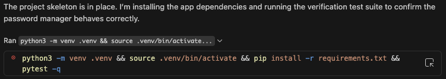

What did you ask Copilot to help you build? How did you break down the problem?
I asked Copilot to help me build a simple password manager with a web application. I broke down the problem by seperating it into three parts, 1. Setting up project Structure, 2. Implement Password Manager App, 3. Add Tests and Verify behavior

How did your approach to asking questions change as you worked?

My approach didn't change all that much, I've worked with AI tools before and am pretty used to their quirks and how to manage them

What parts of the development process with GitHub Copilot surprised you?

Nothing suprised me all that much, other than how slow Github Copilot was compared to other common AI. Something like Claude Code or Codex or Cursor would have been much faster in my opinion. 

What did you learn about the technology you used that you didn't know before?

I don't think that I learned anything super new to me, I have worked with AI on developing Python based applicaions with Web-GUI before and some of the projects I've worked on I've put a few hundred hours into. 

What would you do differently if you had to build this again?

I think I would try to use a different AI. Github Copilot is good for light work, but I personally prefer Claude Code in almost all instances. I much prefer to work in the terminal than in the VSCode application directly, using a multiplexed terminal with NeoVim and Claude Code. 

Github Copilot does do one thing pretty well. It's agents are slow, but the In-line suggestions are always pretty solid. Sometimes they can get annoying when it keeps suggesting something wrong, but it overall speeds up my workflow by a lot when I use VSCode.

